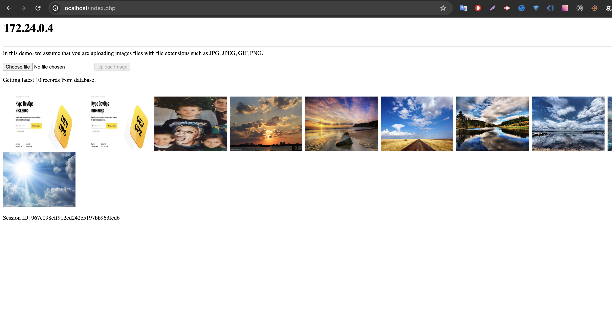

1. Написать Dockerfile для React приложения. Можно сгенерировать ресурсы для веб-сайта (HTML/CSS/JS файлы) прямо из исходников, а можно уже взять готовые из папки build. Собрать образ, запустить и проверить работоспособность приложения в контейнере.

```
cd HW21-1
docker build -t react_app .

docker run -d --name web_react_app -p 8080:3000 react_app
```


2. Написать Dockerfile для LAMP приложения, который устанавливает только само приложение в Apache используя php:apache Docker образ. Написать docker-compose.yaml, который разворачивает зависимости приложения (MySQL и Memcached) и запускает само приложение. Обратить внимание на /docker-entrypoint-initdb.d mount для MySQL, использование которого описано в документации к MySQL Docker образу. Посмотреть, что такое wait-for-it.sh и придумать, как его можно заиспользовать в этом задании.
```
cd HW21-2
```

```
git clone https://github.com/qyjohn/simple-lamp
```

```
docker compose up --build -d
```
```
Добавил проверку с запуском command и wait-for-it.sh на проверку поднятия mysql в php
Но сделал еще дополнительно healthcheck на mysql и php, мне кажется это более понятно при реализации, чем изучать bash скрипт. (хотя роль процесса healthcheck отличается)
```

