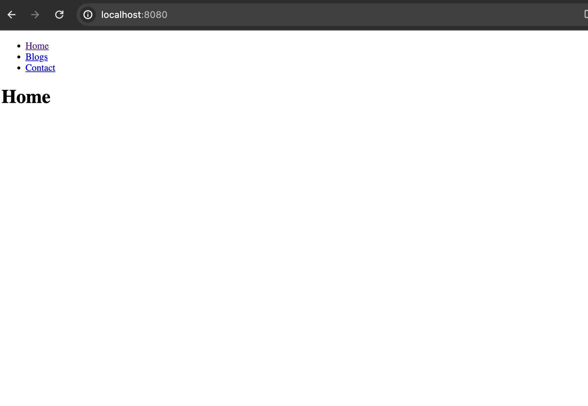

1. Написать Dockerfile для React приложения. Можно сгенерировать ресурсы для веб-сайта (HTML/CSS/JS файлы) прямо из исходников, а можно уже взять готовые из папки build. Собрать образ, запустить и проверить работоспособность приложения в контейнере.

```
cd HW21-1
docker build -t react_app .

docker run -d --name web_react_app -p 8080:3000 react_app
```


2. 